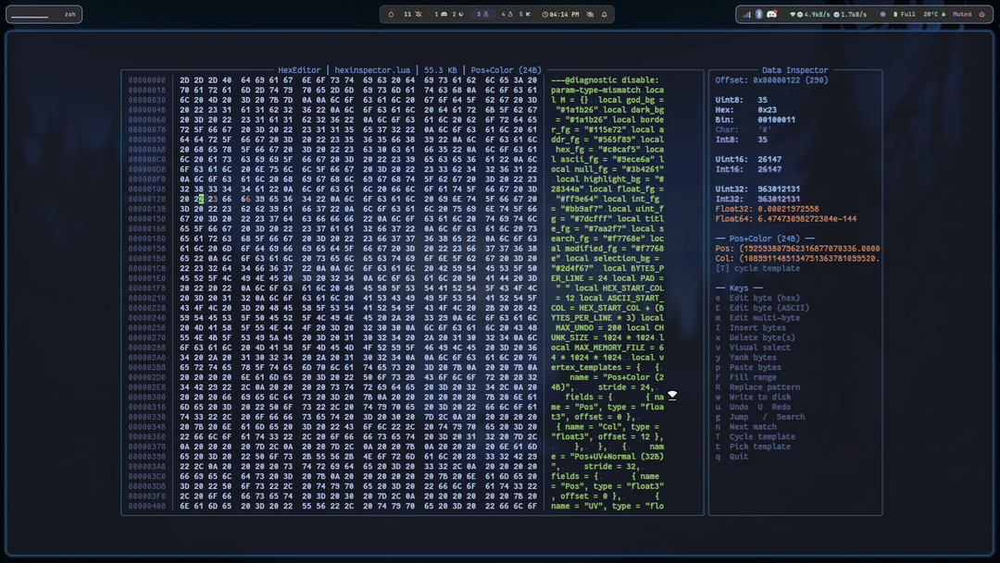

# hexinspector.nvim

A floating hex editor and binary data inspector for Neovim — built for game devs, graphics programmers, and anyone who needs to make sense of raw binary data.

## Why hexinspector?

Most hex editors let you look at bytes. hexinspector lets you **understand** them.

- **Built for 3D/graphics workflows.** The default 24 bytes-per-line layout aligns perfectly with common vertex strides (24B, 48B), so your `Pos+Color`, `Pos+UV+Normal`, and other vertex formats line up row-by-row instead of wrapping unpredictably like they do in 16-byte editors.
- **Vertex template overlays.** Cycle through built-in templates (`Pos+Color`, `Pos+UV+Normal`, `Pos+UV`, `RGBA8888`, etc.) and the inspector panel decodes your vertex data in real time — positions, normals, UVs, colors — right next to the raw hex. No more mental math.
- **It's a data-structure debugger, not just a byte viewer.** The side panel shows uint8/16/32, int8/16/32, float32/64, and binary representations simultaneously. Move the cursor and everything updates instantly.
- **Stays inside Neovim.** Floating windows, vim-native keybindings, no context switching. Open a binary, inspect it, patch it, write it back — all without leaving your editor.
- **Handles large files.** Files over 64 MB stream in chunks so you can inspect multi-gigabyte assets without blowing up memory.

## Features

- Floating hex view with address, hex bytes, and ASCII columns
- Side panel data inspector (uint8/16/32, int8/16/32, float32/64, binary)
- Vertex buffer template overlays (Pos+Color, Pos+UV+Normal, RGBA8888, etc.)
- Visual byte selection with yank/delete/fill
- Hex byte search with wrap-around
- Find and replace hex patterns
- Insert and delete bytes
- Undo/redo stack (up to 200 levels)
- Streaming mode for files larger than 64MB
- Clipboard integration

## Requirements

- Neovim >= 0.9.0

## Demo



## Installation

### lazy.nvim

```lua
{
  "Punity122333/hexinspector.nvim",
  cmd = { "HexEdit", "HexInspect" },
  keys = {
    { "<leader>zx", function() require("hexinspector").open() end, desc = "Hex Editor" },
    {
      "<leader>zX",
      function()
        vim.ui.input({ prompt = "File path: ", default = vim.fn.expand("%:p") }, function(input)
          if input and input ~= "" then
            require("hexinspector").open(input)
          end
        end)
      end,
      desc = "Hex Editor (Pick File)",
    },
  },
  opts = {
    -- All options are optional. Shown below are the defaults.
    -- bytes_per_line = 24,
    -- max_undo = 200,
    -- max_memory_file = 64 * 1024 * 1024,
    -- colors = {
    --   bg           = "#1a1b26",
    --   info_bg      = "#1a1b26",
    --   border       = "#115e72",
    --   addr         = "#565f89",
    --   hex          = "#c0caf5",
    --   ascii        = "#9ece6a",
    --   null         = "#3b4261",
    --   cursor_bg    = "#28344a",
    --   cursor_line_bg = "#1e2030",
    --   float        = "#ff9e64",
    --   int          = "#bb9af7",
    --   uint         = "#7dcfff",
    --   title        = "#7aa2f7",
    --   search       = "#f7768e",
    --   modified     = "#f7768e",
    --   selection_bg = "#2d4f67",
    -- },
  },
}
```

### packer.nvim

```lua
use {
  "Punity122333/hexinspector.nvim",
  config = function()
    require("hexinspector").setup({
      -- colors = { bg = "#282828", hex = "#ebdbb2" },
    })
  end,
}
```

## Usage

```vim
:HexEdit [path]
:HexInspect [path]
```

If no path is given, the current buffer's file is opened.

## Keybindings

Key | Action
--- | ---
`e` | Edit byte (hex)
`E` | Edit byte (ASCII)
`m` | Edit multi-byte
`I` | Insert bytes
`x` | Delete byte(s)
`v` | Visual select
`y` | Yank bytes
`p` | Paste bytes
`F` | Fill range
`R` | Replace pattern
`w` | Write to disk
`u` | Undo
`U` | Redo
`g` | Jump to offset
`/` | Search hex bytes
`n` | Next match
`T` | Cycle vertex template
`t` | Pick vertex template
`<C-d>` | Page down
`<C-u>` | Page up
`G` | Jump to end
`gg` | Jump to start
`q` | Quit

## Vertex Templates

Press `T` to cycle or `t` to pick from a list. The inspector panel decodes the vertex at your cursor using the active template.

Built-in templates:

- **Pos+Color (24B)** — `float3 Pos`, `float3 Col`
- **Pos+UV+Normal (32B)** — `float3 Pos`, `float2 UV`, `float3 Nrm`
- **Pos+Normal+UV (32B)** — `float3 Pos`, `float3 Nrm`, `float2 UV`
- **Pos+UV (20B)** — `float3 Pos`, `float2 UV`
- **RGBA8888 (4B)** — `u8 R`, `u8 G`, `u8 B`, `u8 A`
- **Pos+Color+UV (32B)** — `float3 Pos`, `float3 Col`, `float2 UV`
- **Pos Only (12B)** — `float3 Pos`

You can add your own via `setup()`:

```lua
require("hexinspector").setup({
  vertex_templates = {
    {
      name = "Pos+Tangent (28B)",
      stride = 28,
      fields = {
        { name = "Pos", type = "float3", offset = 0 },
        { name = "Tan", type = "float3", offset = 12 },
        { name = "Sign", type = "float1", offset = 24 },
      },
    },
  },
})
```

## Configuration

All options are optional. Pass them to `setup()`:

```lua
require("hexinspector").setup({
  bytes_per_line = 24,
  max_undo = 200,
  max_memory_file = 64 * 1024 * 1024,
  colors = {
    bg             = "#1a1b26",
    info_bg        = "#1a1b26",
    border         = "#115e72",
    addr           = "#565f89",
    hex            = "#c0caf5",
    ascii          = "#9ece6a",
    null           = "#3b4261",
    cursor_bg      = "#28344a",
    cursor_line_bg = "#1e2030",
    float          = "#ff9e64",
    int            = "#bb9af7",
    uint           = "#7dcfff",
    title          = "#7aa2f7",
    search         = "#f7768e",
    modified       = "#f7768e",
    selection_bg   = "#2d4f67",
  },
})
```

Only specify the keys you want to override — everything else falls back to the defaults above (Tokyo Night–based).

## License

MIT
